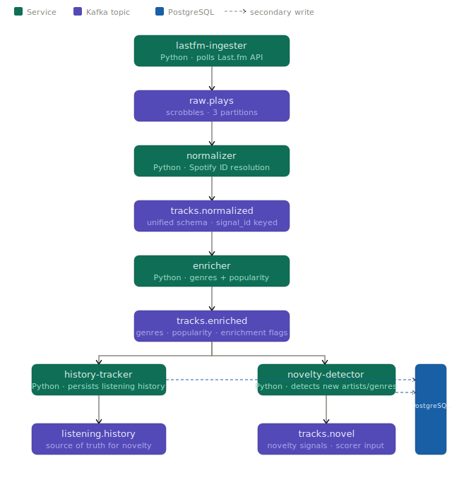
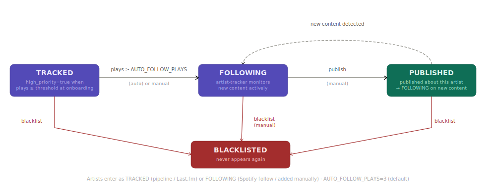

# Signal

Event-driven musical artist discovery system. Ingests your Last.fm listening history, resolves and enriches tracks through Spotify, detects artists and genres you haven't heard before, and surfaces them ranked by novelty.

> **Status**: MVP pipeline implemented — ingestion, normalisation, enrichment, history tracking, and novelty detection are running. Scorer, API, and dashboard are planned (see [Architecture](#architecture)).

---

## Pipeline overview



Each box is an independent Docker container. Each arrow is a Kafka topic. The API reads exclusively from PostgreSQL — never directly from Kafka.

---

## Services

| Service | Language | Consumes | Produces | Description |
|---------|----------|----------|----------|-------------|
| [lastfm-ingester](docs/services/lastfm-ingester.md) | Python | — | `raw.plays` | Polls Last.fm scrobbles |
| [normalizer](docs/services/normalizer.md) | Python | `raw.plays` | `tracks.normalized` | Resolves Spotify IDs; computes `signal_id` |
| [enricher](docs/services/enricher.md) | Python | `tracks.normalized` | `tracks.enriched` | Fetches genres + popularity (Spotify / Last.fm fallback) |
| [history-tracker](docs/services/history-tracker.md) | Python | `tracks.enriched` | `listening.history` | Persists plays and artists to PostgreSQL |
| [novelty-detector](docs/services/novelty-detector.md) | Python | `tracks.enriched` | `tracks.novel` | Detects new artists/genres; auto-promotes artists |
| [shared-common](docs/services/shared-common.md) | Python | — | — | Kafka, DB, logging, rate limiter, circuit breaker |

---

## Quick start

### Prerequisites

- [Docker](https://docs.docker.com/get-docker/) and Docker Compose v2
- [uv](https://docs.astral.sh/uv/) — Python package manager
- A free [Last.fm API key](https://www.last.fm/api/account/create)
- A [Spotify developer app](https://developer.spotify.com/dashboard) with a refresh token

### 1. Clone and install

```bash
git clone https://github.com/FranPerezFolgado/signal.git
cd signal
uv sync
```

### 2. Configure environment

```bash
cp .env.example .env
# Edit .env with your credentials
```

Key variables to set:

```bash
LASTFM_API_KEY=your_api_key_here
LASTFM_USERNAME=your_lastfm_username

SPOTIFY_CLIENT_ID=your_client_id
SPOTIFY_CLIENT_SECRET=your_client_secret
SPOTIFY_REFRESH_TOKEN=your_refresh_token   # see scripts/get_spotify_token.py
```

To get a Spotify refresh token:

```bash
uv run scripts/get_spotify_token.py
```

### 3. Start infrastructure

```bash
make up
```

This starts Kafka (KRaft, no Zookeeper), PostgreSQL, creates all Kafka topics, and runs database migrations automatically.

Verify everything is up:

```bash
make ps            # container status
make kafka-topics  # list topics
```

### 4. Initial onboarding (run once)

Classifies artists from your existing Spotify follows and Last.fm history:

```bash
make onboarding
```

This sets artists you follow on Spotify to `FOLLOWING`, and artists with high play counts to `TRACKED (high_priority)`. See [artist lifecycle](#artist-lifecycle) for details.

### 5. Backfill Last.fm history

Load your full listening history into the pipeline:

```bash
make ingester-backfill
```

### 6. Start the pipeline services

```bash
make services-up
```

Starts all five pipeline services as Docker containers. They will begin processing new scrobbles in real time.

---

## Development

### Install dependencies

```bash
uv sync
```

The workspace includes all services and `shared/python-common` as editable packages.

### Run tests

```bash
# All tests
uv run pytest

# Single service
uv run pytest services/normalizer/
uv run pytest services/enricher/
uv run pytest services/history-tracker/
uv run pytest services/novelty-detector/
uv run pytest shared/python-common/
```

### Lint and format

```bash
uv run ruff check .       # lint
uv run ruff format .      # auto-format
```

### Type checking

```bash
uv run mypy services/ shared/
```

### Run a service locally (without Docker)

```bash
# Export your .env into the shell
set -a && source .env && set +a

# Run a service directly
uv run python -m signal_normalizer
uv run python -m signal_enricher
```

---

## Kafka topics

| Topic | Producers | Consumers | Description |
|-------|-----------|-----------|-------------|
| `raw.plays` | lastfm-ingester | normalizer | Raw Last.fm scrobbles |
| `tracks.normalized` | normalizer | enricher | Unified schema; Spotify IDs resolved |
| `tracks.enriched` | enricher | history-tracker, novelty-detector | Genres, popularity, enrichment flags |
| `listening.history` | history-tracker | *(downstream, planned)* | Committed listening history events |
| `tracks.novel` | novelty-detector | *(scorer, planned)* | Events with novelty signals |
| `history-tracker.dlq` | history-tracker | — | Failed messages from history-tracker |
| `novelty-detector.dlq` | novelty-detector | — | Failed messages from novelty-detector |

All topics: 3 partitions, replication factor 1 (single-node), 7-day retention.

---

## Make targets reference

### Infrastructure

| Target | Description |
|--------|-------------|
| `make up` | Start Kafka + PostgreSQL, create topics, run migrations |
| `make down` | Stop all containers |
| `make restart` | Restart all containers |
| `make infra-clean` | Stop containers and delete all volumes (data loss) |
| `make ps` | Show container status |
| `make logs s=<service>` | Stream logs for a container (e.g. `make logs s=kafka`) |

### Services

| Target | Description |
|--------|-------------|
| `make services-up` | Build and start all pipeline services |
| `make services-down` | Stop all pipeline services (keep infra) |
| `make services-restart` | Rebuild and restart all pipeline services |
| `make <name>-up` | Start a specific service (e.g. `make enricher-up`) |
| `make <name>-logs` | Stream logs for a specific service |
| `make <name>-down` | Stop and remove a specific service container |

### Kafka

| Target | Description |
|--------|-------------|
| `make kafka-topics` | List all topics |
| `make kafka-produce t=<topic>` | Open an interactive producer for a topic |
| `make kafka-consume t=<topic>` | Consume messages from a topic from the beginning |

### Database

| Target | Description |
|--------|-------------|
| `make psql` | Open a psql shell against the `signal` database |

### Other

| Target | Description |
|--------|-------------|
| `make onboarding` | Run the artist classification script (one-off) |
| `make ingester-backfill` | Load full Last.fm history (one-off) |
| `make kafka-ui-up` | Start Kafka UI at http://localhost:8080 |

---

## Monitoring

### Service logs

```bash
# Follow logs for a specific service
make logs s=signal-normalizer
make logs s=signal-enricher
make logs s=signal-history-tracker
make logs s=signal-novelty-detector

# Or directly via Docker
docker logs -f signal-normalizer
```

All services emit structured JSON logs. Key fields: `event`, `signal_id`, `artist`, `error`.

### Kafka UI

A visual Kafka browser is available via the `tools` profile:

```bash
make kafka-ui-up
# Open http://localhost:8080
```

Browse topics, inspect messages, check consumer group lag.

### Dead-letter queues

Monitor DLQ topics for failed messages:

```bash
make kafka-consume t=history-tracker.dlq
make kafka-consume t=novelty-detector.dlq
```

Each DLQ message includes `error_reason`, `error_detail`, and the original payload.

### Database inspection

```bash
make psql
```

Useful queries:

```sql
-- Artist status distribution
SELECT status, COUNT(*) FROM artists GROUP BY status;

-- High-priority artists
SELECT name, scrobble_count, status FROM artists
WHERE high_priority = true ORDER BY scrobble_count DESC;

-- Listening history size
SELECT COUNT(*) FROM listening_history;

-- Recent scrobbles
SELECT artist, title, played_at FROM listening_history
ORDER BY played_at DESC LIMIT 20;
```

---

## Artist lifecycle



Artists enter the system with one of two statuses depending on how they were discovered:

| Origin | Initial status | Auto-promotion |
|--------|----------------|----------------|
| Discovered by pipeline / Last.fm scrobble | `TRACKED` | Yes — when `scrobble_count ≥ AUTO_FOLLOW_PLAYS` |
| Added manually via API | `FOLLOWING` | N/A |
| Spotify follow (onboarding) | `FOLLOWING` | N/A |
| Not followed + plays ≥ `INITIAL_HIGH_PRIORITY_PLAYS` (onboarding) | `TRACKED` + `high_priority=true` | Yes |

From there, all transitions are manual except auto-promotion from `TRACKED` → `FOLLOWING`.

---

## Architecture

The full planned architecture — including the artist-tracker, scorer, API, and dashboard — is documented in:

- **[SIGNAL-Architecture.md](docs/SIGNAL-Architecture.md)** — service descriptions, Kafka topic contracts, state machine diagrams, and the full data flow.
- **[SIGNAL — MVP v2.md](docs/SIGNAL%20%E2%80%94%20MVP%20v2.md)** — MVP scope definition and implementation roadmap.
- **[Full architecture diagram](docs/assets/architecture.svg)** — SVG data flow covering the complete planned system.

---

## Architecture decisions

Each significant technical decision is recorded in `docs/adr/`.

| ADR | Decision | Summary |
|-----|----------|---------|
| [ADR-001](docs/adr/ADR-001-kafka-vs-simple-queues.md) | Kafka as event bus | Multiple consumers of the same stream; replay capability; temporal decoupling between services running at different rates |
| [ADR-002](docs/adr/ADR-002-postgresql-vs-nosql.md) | PostgreSQL over NoSQL | Relational model fits artist + history data; JSONB covers flexible fields; no distribution requirements at MVP scale |
| [ADR-003](docs/adr/ADR-003-uv-workspace.md) | uv workspace | Single lock file across all Python services; editable installs; fast dependency resolution |
| [ADR-004](docs/adr/ADR-004-enrichment-fallback-chain.md) | Enrichment fallback chain | Spotify → Last.fm → pending; avoids losing tracks when Spotify is temporarily unavailable |
| [ADR-005](docs/adr/ADR-005-dead-letter-queue-pattern.md) | Dead-letter queue | Failed messages are quarantined rather than blocking the consumer; the pipeline keeps flowing |
| [ADR-007](docs/adr/ADR-007-normalizer-enricher-split.md) | Normalizer / enricher split | ID resolution (fast, always required) is separated from genre enrichment (slower, can be retried) |
| [ADR-008](docs/adr/ADR-008-audio-features-deprecation.md) | Audio features removed | Spotify deprecated the audio features endpoint; scorer simplified to genre novelty + popularity |
| [ADR-009](docs/adr/ADR-009-dbmate-schema-migrations.md) | dbmate for migrations | Plain SQL migrations without an ORM dependency; runs as a one-shot Docker container on startup |
| [ADR-010](docs/adr/ADR-010-shared-resilience-primitives.md) | Shared resilience primitives | `RateLimiter` and `CircuitBreaker` live in `signal_common` so fixes propagate to all API-calling services |
| [ADR-011](docs/adr/ADR-011-base-spotify-client-and-service-error.md) | Base Spotify client | Common Spotify auth + retry logic extracted to `signal_common` |

---

## Project structure

```
signal/
├── README.md
├── Makefile                        # all dev commands
├── pyproject.toml                  # uv workspace root
├── .env.example                    # environment variable template
│
├── services/
│   ├── lastfm-ingester/            # polls Last.fm → raw.plays
│   ├── normalizer/                 # raw.plays → tracks.normalized
│   ├── enricher/                   # tracks.normalized → tracks.enriched
│   ├── history-tracker/            # tracks.enriched → listening.history + PostgreSQL
│   └── novelty-detector/           # tracks.enriched → tracks.novel
│
├── shared/
│   └── python-common/              # Kafka, DB, logging, rate limiter, circuit breaker
│
├── infra/
│   ├── docker-compose.yml          # Kafka (KRaft) + PostgreSQL + all services
│   └── postgres/
│       ├── init.sql                # initial schema
│       └── migrations/             # dbmate SQL migrations
│
├── scripts/
│   ├── onboarding.py               # initial artist classification (run once)
│   └── get_spotify_token.py        # obtain Spotify refresh token
│
└── docs/
    ├── SIGNAL-Architecture.md      # full system design
    ├── adr/                        # architecture decision records
    ├── services/                   # per-service documentation
    ├── sessions/                   # session summaries
    └── assets/                     # SVG diagrams
        ├── architecture.svg        # full planned architecture
        ├── pipeline-mvp.svg        # current implemented pipeline
        └── artist-states.svg       # artist lifecycle state machine
```

---

## Production deployment

The project is designed for single-node Docker Compose deployment (home server, ZimaBoard, etc.). There is no cloud infrastructure in the MVP.

### 1. Server setup

Ensure Docker Compose v2, `make`, and `git` are installed.

### 2. Clone and configure

```bash
git clone https://github.com/FranPerezFolgado/signal.git
cd signal
cp .env.example .env
# Set all credentials in .env
```

Set a strong `POSTGRES_PASSWORD` in `.env` — the default `signal` is for local development only.

### 3. Start everything

```bash
make up
make onboarding
make ingester-backfill   # load historical data
make services-up
```

### 4. Keep services running

All services use `restart: on-failure` in Docker Compose, so they restart automatically after crashes.

```bash
# Check status
make ps

# View recent logs
make logs s=signal-novelty-detector
```

### 5. Updates

```bash
git pull
make services-restart    # rebuilds images and restarts services
```

Database migrations run automatically when `make up` / `make services-up` is called (via the `migrate` container).

---

## License

[MIT](LICENSE)
