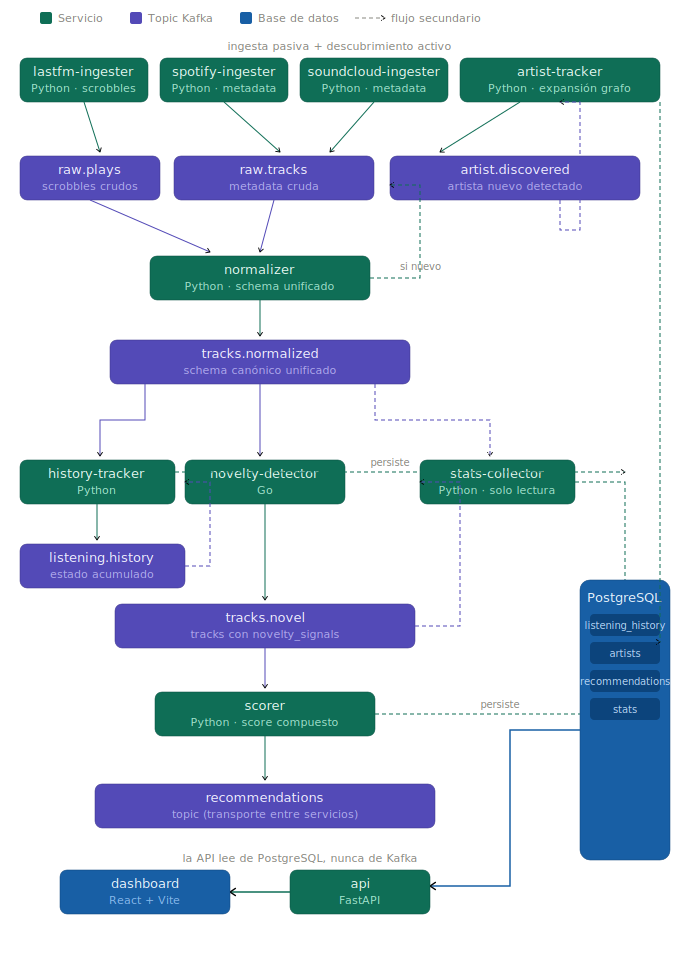
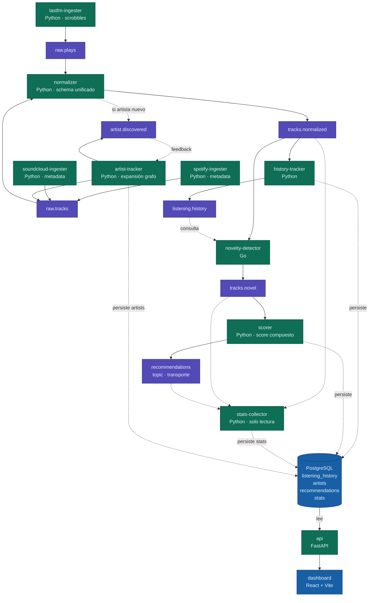
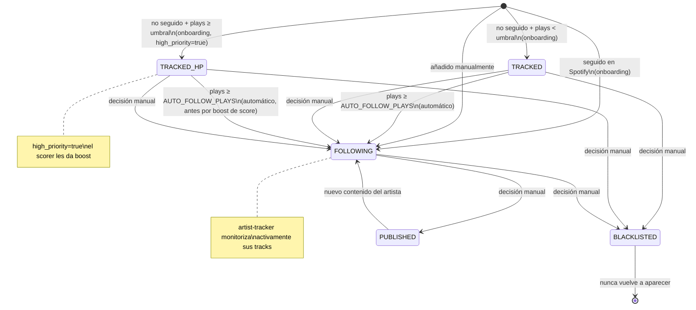
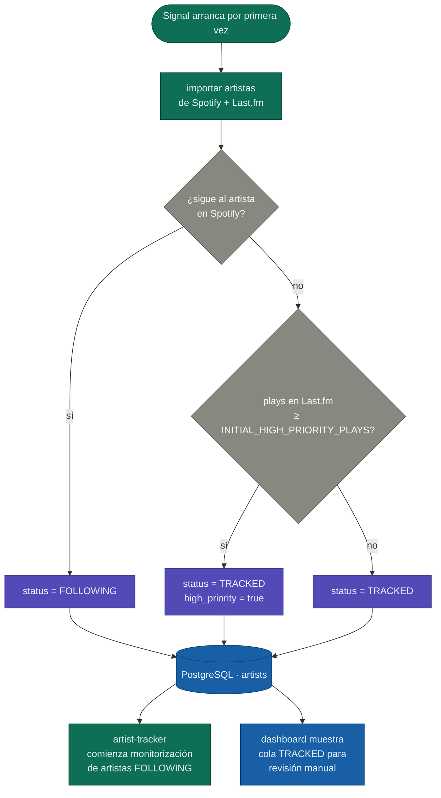
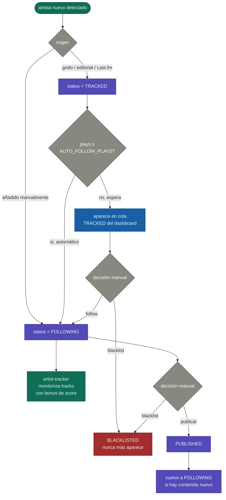
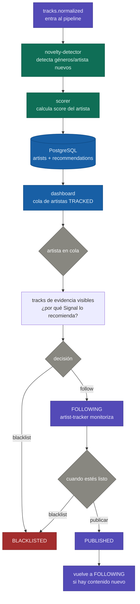
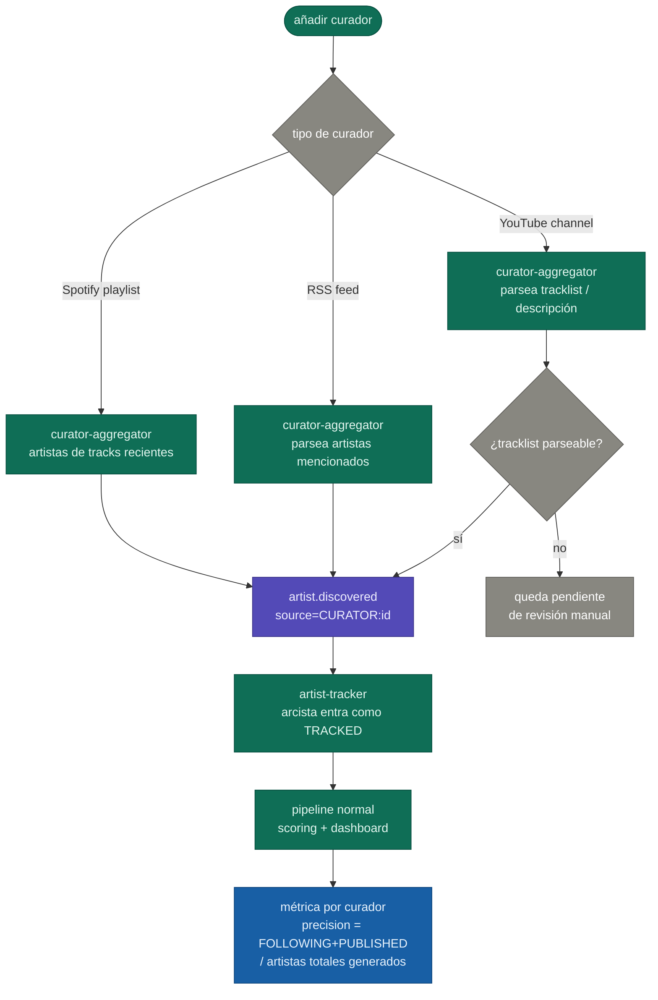
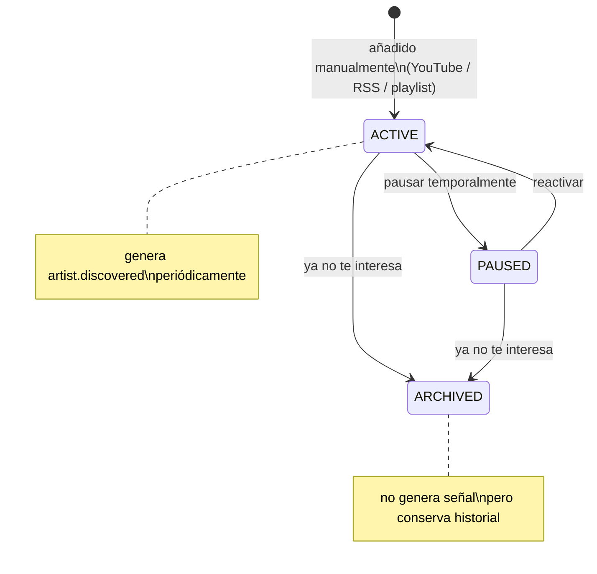

# SIGNAL — Arquitectura del sistema

> Documento de diseño. Versión 4. Actualizar conforme evolucione el sistema.
> Objetivo: pipeline de descubrimiento de artistas asistido por curación humana.

---

## El problema que resuelve Signal

Tienes tres fuentes de datos musicales (Spotify, SoundCloud/Bandcamp, Last.fm) con información heterogénea. El problema es que esas fuentes solo te devuelven lo que tú ya escuchaste: son reactivas, no descubren nada nuevo por sí solas.

**El objetivo de Signal es descubrir artistas, no tracks.** Los tracks son el mecanismo: sirven para detectar géneros, calcular audio features y confirmar que un artista tiene contenido interesante. Una vez cumplida esa función, el track no importa. Lo que publicas, lo que sigues, lo que gestionas, es el artista.

Signal resuelve esto en tres dimensiones:

- **Historial propio**: indexa todo lo que has escuchado como fuente de verdad. Los tracks del historial son señal de géneros y perfil musical, no un fin en sí mismos.
- **Universo de artistas**: mantiene un catálogo de artistas monitorizados (manuales, descubiertos por el sistema, o referenciados por curadores) y explora activamente su contenido nuevo.
- **Universo de curadores**: fuentes editoriales (canales de YouTube, RSS, playlists) que generan señal sobre artistas. Un curador no es un artista: es una fuente de descubrimiento.

La intersección entre estas dimensiones genera recomendaciones de artistas puntuados por novedad y relevancia, para que revises y decidas tú si publicar sobre ellos.

Signal **no automatiza la curación**. Te da señal limpia para que decidas tú.

---

## Visión general del pipeline

```
── INGESTA PASIVA (lo que tú escuchas) ──────────────────────────────

[Last.fm ingester]      ──┐
[Spotify ingester]      ──┼──→ raw.plays / raw.tracks ──→ [normalizer] ──→ tracks.normalized
[SoundCloud ingester]   ──┘

tracks.normalized ──→ [history-tracker] ──→ listening.history (fuente de verdad)

── UNIVERSO DE ARTISTAS (descubrimiento activo) ─────────────────────

tracks.normalized   ──→ [normalizer detecta artista nuevo] ──┐
POST /artists        ──→ [api, alta manual]                  ├──→ artist.discovered
[editorial-aggregator] ──→ (futuro)                          ┘

artist.discovered ──→ [artist-tracker] ──→ busca tracks del artista en Spotify/Last.fm
                                        ──→ raw.tracks  (entra al pipeline normal)

── DETECCIÓN Y SCORING ──────────────────────────────────────────────

tracks.normalized ──→ [novelty-detector] ──→ tracks.novel
                        (cruza con listening.history + artists)

tracks.novel      ──→ [scorer]           ──→ recommendations

── CONSUMO ──────────────────────────────────────────────────────────

recommendations   ──→ [stats-collector]  ──→ PostgreSQL (stats)
recommendations   ──→ [api]              ──→ [dashboard React]

[editorial-aggregator] (futuro) ──→ editorial.signals ──→ scorer (factor adicional)
```

Cada flecha es un topic de Kafka. Cada caja es un servicio independiente.

---

## Topics de Kafka

| Topic | Producers | Consumers | Descripción |
|---|---|---|---|
| `raw.plays` | lastfm-ingester | normalizer | Scrobbles crudos de Last.fm |
| `raw.tracks` | spotify-ingester, soundcloud-ingester, artist-tracker | normalizer | Metadata cruda de tracks |
| `tracks.normalized` | normalizer | novelty-detector, history-tracker, stats-collector | Schema común, fuente canónica |
| `listening.history` | history-tracker | novelty-detector | Estado acumulado de escuchas |
| `artist.discovered` | normalizer, api | artist-tracker, stats-collector | Artista nuevo detectado en el sistema |
| `tracks.novel` | novelty-detector | scorer, stats-collector | Tracks/géneros no escuchados previamente |
| `recommendations` | scorer | api, stats-collector | Artistas candidatos puntuados para revisión editorial |
| `editorial.signals` | editorial-aggregator (futuro) | scorer | Menciones en webs de curación |

---

## Servicios

### lastfm-ingester · Python
**Responsabilidad**: obtener scrobbles de Last.fm API y emitir a `raw.plays`.

- Polling periódico (cada N minutos) o ingesta histórica inicial
- Producer Kafka con mensajes tipados (dataclass serializada a JSON)
- Maneja paginación de la API de Last.fm
- Idempotente: no re-emite plays ya procesados (checkpoint por timestamp)

**Schema raw.plays**:
```json
{
  "source": "lastfm",
  "track_id": "...",
  "artist": "...",
  "title": "...",
  "played_at": "2026-01-01T20:00:00Z",
  "raw": {}
}
```

---

### spotify-ingester · Python
**Responsabilidad**: enriquecer con metadata de Spotify (géneros, audio features, popularidad).

- Consume tu biblioteca, playlists, o búsquedas concretas
- Emite a `raw.tracks` con metadata extendida
- Usa OAuth con refresh token (no interactivo una vez configurado)

**Schema raw.tracks**:
```json
{
  "source": "spotify",
  "track_id": "spotify:track:...",
  "artist": "...",
  "title": "...",
  "genres": ["electronic", "ambient"],
  "popularity": 42,
  "audio_features": {
    "energy": 0.4,
    "valence": 0.6,
    "tempo": 120
  },
  "raw": {}
}
```

---

### soundcloud-ingester · Python
**Responsabilidad**: metadata de tracks en SoundCloud/Bandcamp.

- Similar a spotify-ingester pero con las limitaciones de la API de SoundCloud
- Géneros especialmente útiles aquí (más nicho que Spotify)
- Emite a `raw.tracks`

---

### normalizer · Python
**Responsabilidad**: consumir `raw.plays` y `raw.tracks`, emitir a `tracks.normalized` con schema unificado. También detecta artistas nuevos en el sistema.

- Resuelve el mapping de IDs entre fuentes (mismo track, distintos IDs)
- Normaliza géneros (Spotify y Last.fm usan taxonomías distintas)
- Enriquece: si llega un play sin géneros, los busca en Spotify
- Emite un evento normalizado por track único
- **Detecta artistas nuevos**: si el artista del track no está en la tabla `artists`, emite a `artist.discovered`

**Schema tracks.normalized**:
```json
{
  "signal_id": "sha256 de artist+title normalizado",
  "artist": "...",
  "artist_id": "...",
  "title": "...",
  "genres": ["electronic", "ambient"],
  "sources": ["spotify", "lastfm"],
  "played": true,
  "played_at": "...",
  "audio_features": {},
  "popularity": 42,
  "processed_at": "..."
}
```

---

### artist-tracker · Python
**Responsabilidad**: gestionar el universo de artistas monitorizados y explorar activamente su contenido nuevo.

- Consumer de `artist.discovered`
- Persiste el artista en PostgreSQL con status `TRACKED`
- Periódicamente, para cada artista `TRACKED` o `FOLLOWING`:
  - Consulta `GET /artists/{id}/related-artists` en Spotify → nuevos candidatos a `artist.discovered`
  - Consulta `artist.getSimilar` en Last.fm → nuevos candidatos a `artist.discovered`
  - Consulta `artist.getTopTracks` en Last.fm → emite tracks a `raw.tracks`
  - Consulta los últimos releases del artista en Spotify → emite a `raw.tracks`
- Respeta rate limits de las APIs externas (backoff configurable)
- Idempotente: no re-emite artistas ya conocidos

**Tabla artists en PostgreSQL**:
```sql
artists (
  id            UUID PRIMARY KEY,
  name          TEXT NOT NULL,
  external_ids  JSONB,          -- {"spotify": "...", "lastfm": "..."}
  status        TEXT,           -- TRACKED | FOLLOWING | PUBLISHED | BLACKLISTED
  source        TEXT,           -- MANUAL | SPOTIFY_RELATED | LASTFM_SIMILAR | EDITORIAL
  genres        TEXT[],
  added_at      TIMESTAMPTZ,
  first_seen_at TIMESTAMPTZ,
  last_explored_at TIMESTAMPTZ
)
```

**Schema artist.discovered**:
```json
{
  "artist_id": "...",
  "artist_name": "...",
  "source": "SPOTIFY_RELATED | LASTFM_SIMILAR | MANUAL | NORMALIZER",
  "origin_artist_id": "...",
  "external_ids": {
    "spotify": "...",
    "lastfm": "..."
  },
  "discovered_at": "..."
}
```

---

### history-tracker · Python
**Responsabilidad**: mantener el estado de qué has escuchado.

- Consumer de `tracks.normalized`
- Persiste en PostgreSQL (tabla `listening_history`)
- Emite eventos a `listening.history` cuando añade un track nuevo
- Es la fuente de verdad del "antes" para el novelty-detector

---

### novelty-detector · Go
**Responsabilidad**: detectar tracks y géneros que no están en tu historial de escuchas.

Este servicio está en Go porque:
- Responsabilidad muy acotada y clara
- Lógica de comparación/set membership: idóneo para Go
- Bajo boilerplate de dominio → buen candidato para aprender Go en contexto real
- ADR-002 documenta esta decisión explícitamente

**Lógica**:
1. Consume `tracks.normalized`
2. Consulta `listening.history` vía PostgreSQL (índice en artist+title)
3. Para cada track: ¿está en historial? ¿alguno de sus géneros es nuevo?
4. Si hay novedad → emite a `tracks.novel`

```json
{
  "signal_id": "...",
  "artist": "...",
  "title": "...",
  "genres": ["footwork", "club"],
  "novelty_signals": {
    "track_is_new": true,
    "new_genres": ["footwork"],
    "known_genres": ["club"],
    "genre_novelty_ratio": 0.5
  }
}
```

---

### scorer · Python
**Responsabilidad**: puntuar cada track novel con un score compuesto para priorizarlo en la revisión.

**Fórmula de scoring** (pesos configurables via config file):

```
score = (
  w1 * genre_novelty_ratio      # cuántos géneros son nuevos para ti (0-1)
  + w2 * (1 - popularity_norm)  # favorece tracks menos mainstream (0-1)
  + w3 * audio_distance         # distancia a tu perfil de audio features (0-1)
)
```

Donde:
- `genre_novelty_ratio`: del novelty-detector
- `popularity_norm`: popularidad normalizada (Spotify 0-100 → 0-1)
- `audio_distance`: distancia coseno entre audio features del track y tu perfil medio

El **perfil de audio features** se calcula sobre tu historial (energy, valence, tempo medios).

**Ajuste por artistas en FOLLOWING**: si el artista ya está marcado como seguido editorialmente, el score sube con un bonus configurable. Reconoce validación editorial previa.

**Schema recommendations**:

> Una recomendación es sobre un **artista**, no sobre un track. Los tracks son evidencia que justifica la recomendación.

```json
{
  "artist_id": "...",
  "artist_name": "...",
  "genres": ["footwork", "club"],
  "score": 0.83,
  "score_breakdown": {
    "genre_novelty": 0.9,
    "underground_factor": 0.7,
    "audio_distance": 0.8
  },
  "evidence_tracks": [
    {
      "signal_id": "...",
      "title": "...",
      "source": "spotify",
      "novelty_signals": {}
    }
  ],
  "artist_status": "TRACKED",
  "high_priority": false,
  "processed_at": "..."
}
```

---

### stats-collector · Python
**Responsabilidad**: consumir todos los topics relevantes y materializar agregaciones en PostgreSQL para el dashboard.

- Consumer de solo lectura: no emite nada, sin lógica de negocio
- Escucha `tracks.normalized`, `tracks.novel`, `recommendations`
- Agrega y persiste en tablas de stats en PostgreSQL

**Qué acumula**:
- Tracks procesados por hora/día/semana
- Novel ratio (% de tracks nuevos) por período
- Géneros nuevos descubiertos por mes
- Distribución de scores de recomendaciones
- Fuentes más activas (Spotify vs Last.fm vs SoundCloud)
- Artistas más frecuentes en tu historial
- Evolución de tu perfil de audio features en el tiempo

**Decisión de implementación**: agregaciones simples via queries SQL sobre datos crudos. Solo se materializan las más pesadas si el volumen lo justifica. PostgreSQL es suficiente; TimescaleDB sería over-engineering.

---

### api · Python (FastAPI)
**Responsabilidad**: exponer recomendaciones y gestión del ciclo de vida para el dashboard.

#### Artistas (objeto principal)

```
GET  /artists                        # todos, paginado
GET  /artists?status=TRACKED         # pendientes de valorar
GET  /artists?status=TRACKED&high_priority=true  # cola prioritaria
GET  /artists?status=FOLLOWING       # en seguimiento activo
GET  /artists?status=PUBLISHED       # historial publicado
GET  /artists?status=BLACKLISTED     # descartados permanentemente
GET  /artists/new                    # añadidos recientemente al universo
GET  /artists/{id}                   # detalle + tracks de evidencia + score
POST /artists                        # alta manual → FOLLOWING directo
POST /artists/{id}/follow            # TRACKED → FOLLOWING
POST /artists/{id}/blacklist         # → BLACKLISTED
POST /artists/{id}/publish           # → PUBLISHED
```

#### Curadores

```
GET  /curators                       # todos los curadores
GET  /curators?status=ACTIVE         # activos
POST /curators                       # añadir curador (YouTube, RSS, playlist)
POST /curators/{id}/pause            # pausar monitorización
POST /curators/{id}/archive          # archivar
GET  /curators/{id}/artists          # artistas descubiertos por este curador
```

#### Géneros y estadísticas

```
GET /genres/new          # géneros detectados como nuevos en el último período
GET /stats               # métricas del pipeline
GET /stats/history       # evolución temporal
GET /stats/genres        # géneros descubiertos por mes
GET /stats/sources       # fuentes más activas
GET /stats/artists       # artistas nuevos por período, top por score
GET /stats/curators      # qué curadores generan más artistas en FOLLOWING/PUBLISHED
```

#### Estado de un artista

```
UNKNOWN ──→ TRACKED ──────────→ FOLLOWING ──→ PUBLISHED
                  │  (auto o          │
                  │   manual)         └──→ BLACKLISTED
                  └──→ BLACKLISTED
```

- `TRACKED`: el sistema lo conoce, pendiente de valoración
- `TRACKED + high_priority`: muchos plays pero no seguido en Spotify, aparece antes en la cola
- `FOLLOWING`: has decidido que te interesa, artist-tracker monitoriza activamente
- `PUBLISHED`: has publicado sobre él, vuelve a FOLLOWING si hay contenido nuevo
- `BLACKLISTED`: nunca más aparece

#### Estado de un curador

```
ACTIVE ──→ PAUSED ──→ ACTIVE
       └──→ ARCHIVED
```

---

### dashboard · React + Vite
**Responsabilidad**: interfaz de revisión personal. Consume la API.

**Cuatro secciones**:

**Cola de artistas TRACKED** (uso diario)
- Artistas pendientes de valorar, ordenados por score
- Primero los `high_priority`, luego el resto
- Tracks de evidencia visibles: por qué Signal lo recomienda
- Acciones inline: follow / blacklist
- Filtros por género, fuente, curador de origen

**Artistas FOLLOWING**
- Artistas que ya has validado, pendientes de publicar
- Tracks recientes del artista
- Acción: publish / blacklist

**Curadores**
- Lista de curadores activos con métricas (artistas generados, tasa de acierto)
- Añadir nuevo curador (YouTube, RSS, playlist)

**Exploración**
- Géneros nuevos detectados en el período
- Artistas descubiertos por expansión del grafo

**Stats**
- Novel ratio en el tiempo
- Géneros descubiertos por mes
- Artistas nuevos por semana
- Distribución de scores
- Fuentes más activas
- Evolución del perfil de audio features

**Decisiones de stack**:
- React + Vite (no Next.js — sin SSR ni SEO necesarios para uso personal)
- Vive en `dashboard/` dentro del monorepo
- Swagger UI disponible en desarrollo como alternativa ligera

---

### curator-aggregator · Python (futuro)
**Responsabilidad**: monitorizar curadores (canales YouTube, RSS, playlists) y extraer artistas mencionados, emitiendo a `artist.discovered`.

Un curador es una fuente de señal editorial, no un artista. Tipos:
- **YouTube channel**: Boiler Room, Cercle, NTS Live, canales de sellos
- **RSS feed**: Resident Advisor, Pitchfork, FACT, Bandcamp Daily, blogs de sellos
- **Spotify playlist**: playlists editoriales de sellos o curadores que actualizan regularmente

Lógica:
- Para RSS: parsea artistas mencionados en los artículos → `artist.discovered` con `source=CURATOR:{id}`
- Para YouTube: parsea descripción/tracklist del vídeo → artistas → `artist.discovered`
- Para Spotify playlists: artistas de los tracks añadidos recientemente → `artist.discovered`
- Si no hay tracklist parseable (YouTube sin descripción) → curador queda como fuente pendiente de procesado manual

El scorer puede usar la señal del curador como factor adicional: un artista referenciado por un curador de alta tasa de acierto sube en el ranking.

Métrica clave por curador: `precision = artistas_en_FOLLOWING_o_PUBLISHED / artistas_totales_generados`. Te dice qué curadores afinan mejor con tu gusto.

**No bloquea el desarrollo del core**: se añade cuando el pipeline principal funcione.

---

## Stack tecnológico

| Componente | Tecnología | Justificación |
|---|---|---|
| Messaging | Kafka + Schema Registry | Múltiples consumers del mismo stream, replay, ritmos de ingesta distintos |
| Ingesters | Python 3.12 | SDKs de APIs musicales maduros, rapidez de desarrollo |
| Normalizer | Python | Lógica de transformación, fácil de testear |
| History tracker | Python | ORM, persistencia |
| Artist tracker | Python | Polling de APIs externas, ORM, lógica de expansión de grafo |
| Novelty detector | **Go** | Servicio acotado, demostrar polivalencia de lenguaje |
| Scorer | Python | Cálculos numéricos, numpy disponible |
| Stats collector | Python | Consumer simple, queries SQL |
| API | Python / FastAPI | Estándar de facto en Python APIs |
| Dashboard | React + Vite | Interactividad, sin necesidad de SSR |
| BD | PostgreSQL | Historial, artistas, recomendaciones, stats |
| Observabilidad | OpenTelemetry + Prometheus + Grafana | Tier 1 del roadmap |
| CI/CD | GitHub Actions | Tier 2 del roadmap |
| Infra local | Docker Compose → k3s | Evolución natural del roadmap |
| Infra cloud | EKS + Terraform | Fase final del roadmap |

---

## Estructura de repositorio

```
signal/
├── CLAUDE.md                        # contexto del sistema para Claude Code
├── docs/
│   ├── architecture/
│   │   └── overview.md
│   └── adr/
│       ├── 001-kafka-over-rabbitmq.md
│       ├── 002-go-for-novelty-detector.md
│       ├── 003-scoring-formula.md
│       ├── 004-hexagonal-architecture.md
│       ├── 005-recommendation-lifecycle.md
│       └── 006-artist-universe-vs-listening-history.md
├── services/
│   ├── lastfm-ingester/             # Python
│   ├── spotify-ingester/            # Python
│   ├── soundcloud-ingester/         # Python
│   ├── normalizer/                  # Python
│   ├── history-tracker/             # Python
│   ├── artist-tracker/              # Python
│   ├── curator-aggregator/          # Python (futuro)
│   ├── novelty-detector/            # Go
│   ├── scorer/                      # Python
│   ├── stats-collector/             # Python
│   └── api/                         # Python / FastAPI
├── dashboard/                       # React + Vite
├── shared/
│   ├── schemas/                     # Schemas JSON/Avro compartidos
│   └── python-common/               # Kafka client wrapper, logging, utils
├── infra/
│   ├── docker-compose.yml
│   ├── k8s/
│   └── terraform/
├── .github/
│   └── workflows/
│       ├── ci.yml
│       └── deploy.yml
└── README.md
```

---

## ADRs a escribir (por orden)

1. **001-kafka-over-rabbitmq**: múltiples consumers del mismo stream, necesidad de replay, ritmos de ingesta distintos.
2. **002-go-for-novelty-detector**: responsabilidad acotada, sin ORM, sin dominio complejo, aprendizaje en contexto real.
3. **003-scoring-formula**: por qué estos tres factores, cómo se calibran, qué se descartó.
4. **004-hexagonal-architecture**: separar dominio de infraestructura en servicios Python.
5. **005-artist-lifecycle**: por qué máquina de estados explícita y no flags booleanos. Incluye la lógica de onboarding con fecha de corte y umbral de plays.
6. **006-artist-universe-vs-listening-history**: por qué separar el universo de artistas del historial de escuchas como dos dimensiones independientes, y cómo la expansión por grafo resuelve el problema de descubrimiento activo.
7. **007-curators-as-signal-sources**: por qué modelar curadores como entidad separada en vez de solo como fuentes de tracks. Incluye la métrica de precision por curador.

---

## Orden de implementación

### Fase 1 — Pipeline mínimo (sin Go todavía)
1. `docker-compose.yml`: Kafka + Zookeeper + PostgreSQL
2. `lastfm-ingester` → emite a `raw.plays`
3. `normalizer` básico → consume `raw.plays`, emite a `tracks.normalized`
4. `history-tracker` → persiste en PostgreSQL
5. ✅ Validar: historial de Last.fm visible en BD

### Fase 2 — Enriquecimiento
6. `spotify-ingester` → emite a `raw.tracks`
7. Ampliar `normalizer` → fusiona `raw.plays` + `raw.tracks`, detecta artistas nuevos, emite `artist.discovered`
8. ✅ Validar: tracks con géneros y audio features en BD, artistas en tabla `artists`

### Fase 3 — Universo de artistas y descubrimiento activo
9. `artist-tracker` → consume `artist.discovered`, persiste artistas, expande grafo periódicamente
10. Validar: artistas relacionados aparecen en la tabla con `source=SPOTIFY_RELATED`
11. Validar: tracks de artistas monitorizados llegan a `raw.tracks` sin que tú los hayas escuchado
12. ✅ Validar: `GET /artists/new` devuelve artistas recién descubiertos

### Fase 4 — Novelty y scoring (entra Go)
13. `novelty-detector` en Go → emite `tracks.novel`
14. `scorer` → emite `recommendations`
15. ✅ Validar: recomendaciones con score en el topic, incluyendo tracks de artistas que nunca has escuchado

### Fase 5 — API y ciclo de vida
16. `api` FastAPI con todos los endpoints de recomendaciones y artistas
17. Ciclo de vida completo: PENDING → REVIEWING → PUBLISHED/DISCARDED/SNOOZED
18. Estado de artistas: TRACKED / FOLLOWING / PUBLISHED / BLACKLISTED
19. ✅ Validar: puedes gestionar tu cola y tu universo de artistas desde Swagger UI

### Fase 6 — Stats
20. `stats-collector` escuchando todos los topics
21. Endpoints `/stats/*` en la API
22. ✅ Validar: datos agregados consultables, incluyendo artistas nuevos por semana

### Fase 7 — Dashboard
23. React + Vite en `dashboard/`
24. Cola de revisión con acciones inline
25. Sección de artistas: TRACKED para valorar, FOLLOWING en seguimiento
26. Sección de stats con gráficas
27. ✅ Validar: no necesitas Swagger para el uso diario

### Fase 8 — Observabilidad y CI/CD
28. OpenTelemetry en todos los servicios
29. Grafana: tracks/hora, novel ratio, artistas nuevos/semana, score distribution
30. GitHub Actions: lint + test + build imágenes
31. Schema Registry para los topics principales

### Fase 9 — K8s y cloud
32. k3s en ZimaBoard
33. Helm charts por servicio
34. EKS + Terraform

### Fase 10 — Editorial (futuro)
35. `editorial-aggregator`: RSS + scraping de webs de curación
36. `editorial.signals` topic
37. Scorer consume señal editorial como factor adicional
38. Artistas mencionados en editoriales → `artist.discovered` automático

---

## Bullets de CV que este proyecto genera

| Logro | Bullet |
|---|---|
| Pipeline Kafka polyglot | Designed and implemented an event-driven artist discovery pipeline with Kafka, processing tracks from 3 heterogeneous sources (Spotify, Last.fm, SoundCloud) as signals for artist scoring and classification |
| Artist universe + grafo | Built an artist tracking system that expands a monitored universe via Spotify/Last.fm related-artist graphs, enabling proactive discovery beyond personal listening history |
| Novelty detector en Go | Built a novelty detection service in Go within a Python-dominant system, identifying unseen tracks and genres against a continuously updated listening history |
| Scoring configurable | Implemented a configurable multi-factor scoring engine combining genre novelty ratio, underground factor, and cosine audio feature distance |
| Ciclo de vida de recomendaciones | Designed a recommendation lifecycle state machine (PENDING → REVIEWING → PUBLISHED/DISCARDED/SNOOZED) and an artist state machine (TRACKED → FOLLOWING → PUBLISHED/BLACKLISTED) for editorial workflow |
| Stats collector | Built a read-only Kafka consumer materializing pipeline aggregations (novel ratio, score distribution, source activity, artist discovery rate) into PostgreSQL for dashboard consumption |
| Dashboard React | Built a personal curation dashboard in React + Vite consuming a FastAPI backend, replacing manual Swagger-based workflow |
| Observabilidad completa | Instrumented all services with OpenTelemetry, exposing pipeline metrics via Prometheus/Grafana |
| K8s deployment | Deployed an 11-service polyglot system to Kubernetes using Helm, managing stateful (PostgreSQL, Kafka, Redis) and stateless workloads |

---

## Diagrama de flujo de datos

> Servicios (verde), topics de Kafka (morado), base de datos (azul). Líneas discontinuas = flujos secundarios. La API lee exclusivamente de PostgreSQL, nunca de Kafka.



---

## Diagrama Mermaid del flujo de datos



---

## Clasificación de artistas

### Lógica de onboarding (carga inicial)

Al arrancar Signal por primera vez, se importa el historial de Spotify y Last.fm y se clasifica cada artista según dos señales combinadas: si el usuario lo sigue explícitamente en Spotify, y cuántos plays acumula en Last.fm.

| Condición | Status inicial | Notas |
|---|---|---|
| Seguido en Spotify | `FOLLOWING` | Gesto explícito del usuario |
| No seguido + plays ≥ `INITIAL_HIGH_PRIORITY_PLAYS` (default: 20) | `TRACKED` + `high_priority=true` | Escuchas frecuentes sin seguimiento explícito |
| No seguido + plays < umbral | `TRACKED` | Historial normal, sin prioridad |

### Lógica de seguimiento continuo

Una vez Signal está corriendo, los artistas nuevos entran siempre como `TRACKED` y el sistema decide si promoverlos automáticamente según el umbral de plays configurado (`AUTO_FOLLOW_PLAYS`, default: 3).

| Origen | Status inicial | Promoción automática |
|---|---|---|
| Detectado por el sistema (grafo, editoriales) | `TRACKED` | Sí, al superar `AUTO_FOLLOW_PLAYS` |
| Escucha nueva en Last.fm | `TRACKED` | Sí, al superar `AUTO_FOLLOW_PLAYS` |
| Añadido manualmente vía API o dashboard | `FOLLOWING` | No aplica |

### Variables de configuración

```
INITIAL_HIGH_PRIORITY_PLAYS=20   # umbral de plays para high_priority en onboarding
AUTO_FOLLOW_PLAYS=3              # plays necesarios para promoción automática a FOLLOWING
```

---

## Diagrama de estados de artistas



---

## Diagrama de flujo de onboarding



---

## Diagrama de flujo de artista nuevo (seguimiento continuo)



---

## Diagrama de flujo de recomendación (artista-céntrico)

> Una recomendación no es un track pendiente de revisar. Es un artista con tracks de evidencia que justifican por qué apareció.



---

## Diagrama de flujo de curador

> Un curador no es un artista. Es una fuente editorial que genera señal sobre artistas.



---

## Diagrama de estados de curadores


