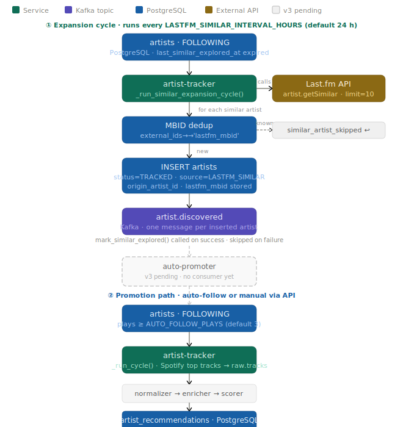

# Artist Discovery Flow (LASTFM_SIMILAR)

How an artist goes from "a similar artist on Last.fm" to appearing in `artist_recommendations`.



---

## ① Expansion cycle

Runs every `LASTFM_SIMILAR_INTERVAL_HOURS` (default 24 h). Fires immediately on startup.

**Trigger**: any `FOLLOWING` artist whose `last_similar_explored_at` is `NULL` or older than the interval.

**Steps**:

1. `artist-tracker` calls `Last.fm artist.getSimilar` for each eligible artist (up to `LASTFM_SIMILAR_LIMIT`, default 10 results).
2. For each result:
   - If the similar artist has an MBID **and** it matches `external_ids->>'lastfm_mbid'` for any existing row → **skip** (`similar_artist_skipped` log). No status change, no Kafka message.
   - Otherwise → `INSERT artists` with `status=TRACKED`, `source=LASTFM_SIMILAR`, `origin_artist_id` pointing to the FOLLOWING artist that triggered discovery.
   - On insert → produce one `artist.discovered` message to Kafka.
3. `mark_similar_explored()` updates `last_similar_explored_at = now()` — **only on success**. If the artist fails mid-cycle, it will be retried on the next run.

**Querying discovered artists**:

```sql
SELECT a.name, a.status, o.name AS discovered_from, a.external_ids->>'lastfm_mbid' AS mbid
FROM artists a
LEFT JOIN artists o ON o.id = a.origin_artist_id
WHERE a.source = 'LASTFM_SIMILAR'
ORDER BY a.added_at DESC;
```

---

## `artist.discovered` — event log for future consumers

`artist.discovered` events are produced to Kafka as an append-only audit trail. No service consumes them in v3 — that is intentional.

The discovery loop closes at the **TRACKED queue**: newly discovered artists appear in the DB as `TRACKED` for manual review. Auto-promotion was considered and rejected — promoting everything to `FOLLOWING` would bypass curation and flood the recommendations table with unvetted artists.

Future consumers (v6 curators) will use this topic to calculate curator precision metrics.

---

## ② Promotion path

A `LASTFM_SIMILAR` artist reaches `FOLLOWING` via one of two paths:

**Manual** (primary): browse `GET /artists?status=TRACKED&source=LASTFM_SIMILAR` in the API and promote via `PATCH /artists/{id}/status { "status": "FOLLOWING" }`.

**Organic**: the user listens to the artist on Last.fm:

1. The user encounters and listens to the artist on Last.fm.
2. `lastfm-ingester` picks up the scrobbles → `raw.plays` → `normalizer` → `enricher` → `history-tracker` persists the plays.
3. Once `play_count ≥ AUTO_FOLLOW_PLAYS` (default 3), `novelty-detector` auto-promotes the artist to `FOLLOWING`.
4. The artist is now eligible for the **top-tracks cycle**.

---

## Full loop (once promoted to FOLLOWING)

```
FOLLOWING
  → artist-tracker: Spotify top tracks → raw.tracks
  → normalizer → tracks.normalized
  → enricher   → tracks.enriched
  → novelty-detector → tracks.novel
  → scorer → artist_recommendations
```

The artist then competes for recommendations alongside all other `FOLLOWING` artists based on genre novelty and popularity scores.

---

## Deduplication guarantees

| Scenario | Behaviour |
|---|---|
| Artist already in DB with matching MBID (any status) | Skipped — `similar_artist_skipped` logged, no insert |
| Artist already in DB with same name (no MBID) | `ON CONFLICT (LOWER(name)) DO NOTHING` — insert returns `NULL`, no Kafka message |
| Artist not in DB | Inserted as `TRACKED` · `LASTFM_SIMILAR` |
| Last.fm returns empty MBID | MBID check skipped, falls through to name uniqueness |

---

## Related

- [ADR-016](adr/ADR-016-lastfm-similar-artist-expansion.md) — decision record for this feature
- [artist-states.svg](assets/artist-states.svg) — full state machine (TRACKED → FOLLOWING → PUBLISHED / BLACKLISTED)
- [pipeline-mvp.svg](assets/pipeline-mvp.svg) — track processing pipeline
